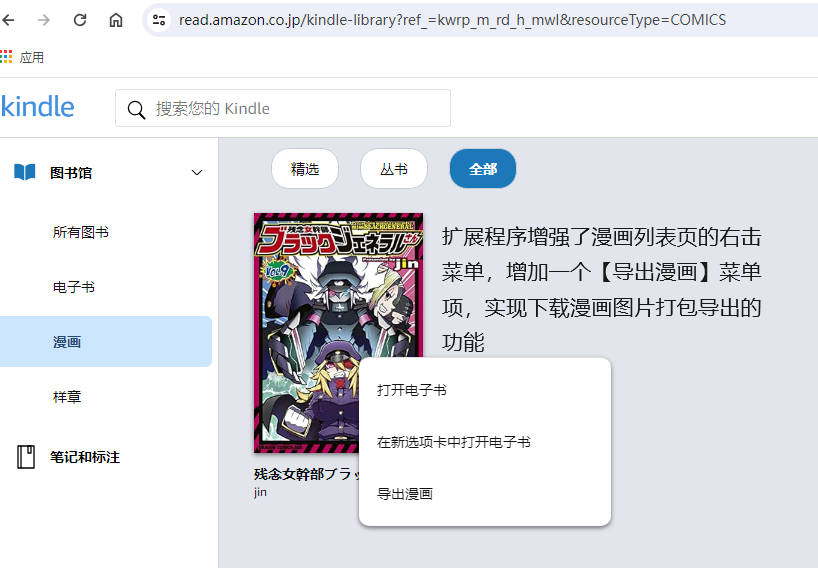

# 亚马逊漫画下载器
## 浏览器扩展程序

###
扩展程序增强了漫画列表页的右击菜单，增加一个【导出漫画】菜单项，实现下载漫画图片打包导出的功能。

[文字版教程](使用教程.txt)

扩展程序基于Chrome Extensions API开发，在Chrome 125.0.6382.3 (正式版本) dev （64 位）上进行测试。按照官方说明理论上支持Chrome 99以上版本。至于新版的Edge没有测试过。要是有朋友能帮忙测试反馈一下问题就好。

### 技术支持
* [Chrome Developers Extensions](https://developer.chrome.com/docs/extensions/)
* [FileSaver.js](http://purl.eligrey.com/github/FileSaver.js)
* [jszip](https://github.com/Stuk/jszip)
